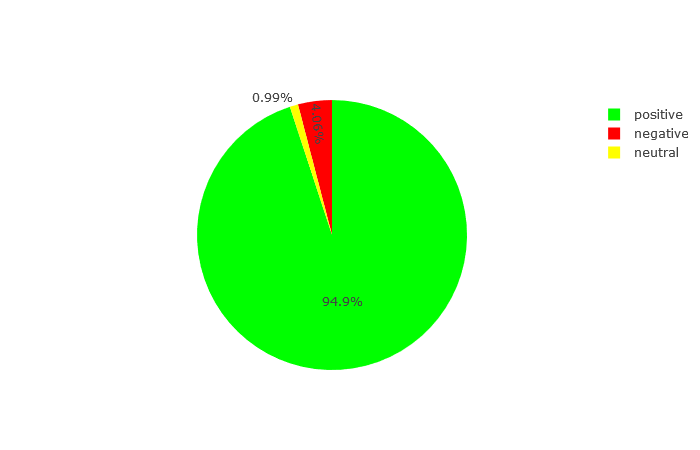
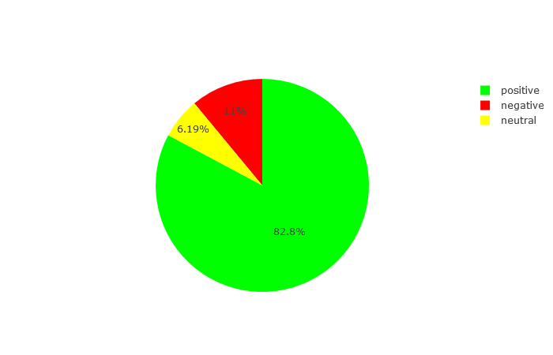
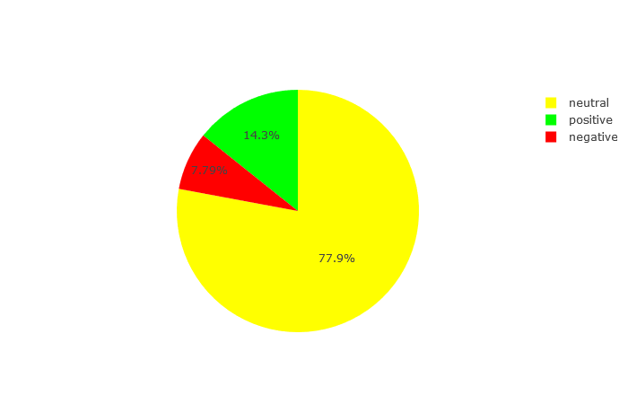

# tripadvisor-singapore
python script to scrape reviews from tripadvisor. perform sentiment analysis and word frequency count.
this built upon cs50 sentiments assignment.  
https://captmomo.github.io/tripadvisor-singapore-zoo/  
## Sentiment analysis piechart

## Results using VADER sentiment intensity analyzer

### Results from totaling the score for each review:

### Results from analyzing the entire text as a whole:

## Top 50 most frequently used words
<table cellspacing="5" cellpadding="2">
<tbody>
<tr>
<th>Word</th>
<th>Occurances</th>
</tr>
<tr>
<td>zoo</td>
<td>20561</td>
</tr>
<tr>
<td>animals</td>
<td>12605</td>
</tr>
<tr>
<td>singapore</td>
<td>6001</td>
</tr>
<tr>
<td>see</td>
<td>5729</td>
</tr>
<tr>
<td>day</td>
<td>5504</td>
</tr>
<tr>
<td>well</td>
<td>5305</td>
</tr>
<tr>
<td>great</td>
<td>4819</td>
</tr>
<tr>
<td>get</td>
<td>4554</td>
</tr>
<tr>
<td>good</td>
<td>4076</td>
</tr>
<tr>
<td>time</td>
<td>3998</td>
</tr>
<tr>
<td>around</td>
<td>3962</td>
</tr>
<tr>
<td>one</td>
<td>3916</td>
</tr>
<tr>
<td>visit</td>
<td>3899</td>
</tr>
<tr>
<td>safari</td>
<td>3711</td>
</tr>
<tr>
<td>kids</td>
<td>3350</td>
</tr>
<tr>
<td>night</td>
<td>3180</td>
</tr>
<tr>
<td>place</td>
<td>3174</td>
</tr>
<tr>
<td>also</td>
<td>3099</td>
</tr>
<tr>
<td>breakfast</td>
<td>2854</td>
</tr>
<tr>
<td>really</td>
<td>2773</td>
</tr>
<tr>
<td>best</td>
<td>2722</td>
</tr>
<tr>
<td>shows</td>
<td>2633</td>
</tr>
<tr>
<td>would</td>
<td>2539</td>
</tr>
<tr>
<td>take</td>
<td>2520</td>
</tr>
<tr>
<td>go</td>
<td>2513</td>
</tr>
<tr>
<td>like</td>
<td>2493</td>
</tr>
<tr>
<td>tram</td>
<td>2393</td>
</tr>
<tr>
<td>show</td>
<td>2383</td>
</tr>
<tr>
<td>many</td>
<td>2364</td>
</tr>
<tr>
<td>animal</td>
<td>2349</td>
</tr>
<tr>
<td>experience</td>
<td>2228</td>
</tr>
<tr>
<td>food</td>
<td>2212</td>
</tr>
<tr>
<td>worth</td>
<td>2089</td>
</tr>
<tr>
<td>close</td>
<td>1942</td>
</tr>
<tr>
<td>water</td>

<td>1901</td>

</tr>

<tr>

<td>park</td>

<td>1899</td>

</tr>

<tr>

<td>orangutans</td>

<td>1783</td>

</tr>

<tr>

<td>zoos</td>

<td>1781</td>

</tr>

<tr>

<td>walk</td>

<td>1777</td>

</tr>

<tr>

<td>much</td>

<td>1758</td>

</tr>

<tr>

<td>must</td>

<td>1723</td>

</tr>

<tr>

<td>feeding</td>

<td>1691</td>

</tr>

<tr>

<td>enclosures</td>

<td>1570</td>

</tr>

<tr>

<td>amazing</td>

<td>1540</td>

</tr>

<tr>

<td>lot</td>

<td>1538</td>

</tr>

<tr>

<td>nice</td>

<td>1532</td>

</tr>

<tr>

<td>area</td>

<td>1530</td>

</tr>

<tr>

<td>children</td>

<td>1488</td>

</tr>

<tr>

<td>lots</td>

<td>1485</td>

</tr>

<tr>

<td>bus</td>

<td>1483</td>

</tr>
</tbody>
</table>
  
## Animals mentioned
<table cellspacing="5" cellpadding="2">

<tbody>

<tr>

<th>Animal</th>

<th>Occurances</th>

</tr>

<tr>

<td>orangutan</td>

<td>2160</td>

</tr>

<tr>

<td>bear</td>

<td>1523</td>

</tr>

<tr>

<td>monkey</td>

<td>1057</td>

</tr>

<tr>

<td>lion</td>

<td>674</td>

</tr>

<tr>

<td>lemur</td>

<td>271</td>

</tr>

<tr>

<td>snake</td>

<td>234</td>

</tr>

<tr>

<td>kangaroo</td>

<td>176</td>

</tr>

<tr>

<td>baboon</td>

<td>174</td>

</tr>

<tr>

<td>hippo</td>

<td>147</td>

</tr>

<tr>

<td>zebra</td>

<td>130</td>

</tr>

<tr>

<td>penguin</td>

<td>115</td>

</tr>

<tr>

<td>cheetah</td>

<td>112</td>

</tr>

<tr>

<td>leopard</td>

<td>100</td>

</tr>

<tr>

<td>otter</td>

<td>90</td>

</tr>

<tr>

<td>komodo</td>

<td>80</td>

</tr>

<tr>

<td>sloth</td>

<td>80</td>

</tr>

<tr>

<td>dog</td>

<td>76</td>

</tr>

<tr>

<td>deer</td>

<td>74</td>

</tr>

<tr>

<td>goat</td>

<td>66</td>

</tr>

<tr>

<td>fox</td>

<td>66</td>

</tr>

<tr>

<td>parrot</td>

<td>47</td>

</tr>

<tr>

<td>lizard</td>

<td>42</td>

</tr>

<tr>

<td>python</td>

<td>42</td>

</tr>

<tr>

<td>tapir</td>

<td>33</td>

</tr>

<tr>

<td>tamarin</td>

<td>32</td>

</tr>

<tr>

<td>meerkat</td>

<td>31</td>

</tr>

<tr>

<td>flamingo</td>

<td>27</td>

</tr>

<tr>

<td>gibbon</td>

<td>23</td>

</tr>

<tr>

<td>rabbit</td>

<td>19</td>

</tr>

<tr>

<td>rat</td>

<td>19</td>

</tr>

<tr>

<td>cobra</td>

<td>16</td>

</tr>

<tr>

<td>mole</td>

<td>14</td>

</tr>

<tr>

<td>warthog</td>

<td>12</td>

</tr>

<tr>

<td>arapaima</td>

<td>10</td>

</tr>

<tr>

<td>iguana</td>

<td>8</td>

</tr>

<tr>

<td>panther</td>

<td>8</td>

</tr>

<tr>

<td>raccoon</td>

<td>8</td>

</tr>

<tr>

<td>pig</td>

<td>7</td>

</tr>

<tr>

<td>babirusa</td>

<td>7</td>

</tr>

<tr>

<td>hog</td>

<td>7</td>

</tr>

<tr>

<td>boa</td>

<td>7</td>

</tr>

<tr>

<td>saki</td>

<td>5</td>

</tr>

<tr>

<td>giraffe</td>

<td>4</td>

</tr>

<tr>

<td>falabella</td>

<td>3</td>

</tr>

<tr>

<td>rhinoceros</td>

<td>3</td>

</tr>

<tr>

<td>hippopotamus</td>

<td>1</td>

</tr>

<tr>

<td>terrapin</td>

<td>1</td>

</tr>

</tbody>

</table>
